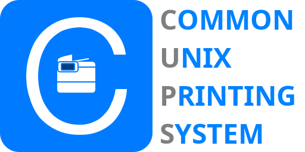

## Home Assistant App: CUPS

### Features
- Hosts a [CUPS](https://www.cups.org/) Server
- Detects printers connected to Home Assistants host system.
- Announces printers on the local network over mDNS (zeroconf/avahi)

### Restrictions
- Can announce but not discover printers using mDNS
- Only stock and brother printers are preinstalled (Create an issue to request another package)
- No Ingress (yet?)

## Help
### Installation
1. Click: 
2. Click OK on the pop-up to add my repo to Home Assistant
3. Click install

### More infos
- **Webinterface:** Can be accessed by navigating to `https://[HOSTNAME]:631`
- **Config-files:** Can be accessed through `addon_configs`-folder
- **More infos:** Are on [the repo add-on-page](https://github.com/Switch123456789/Home-Assistant-Apps)